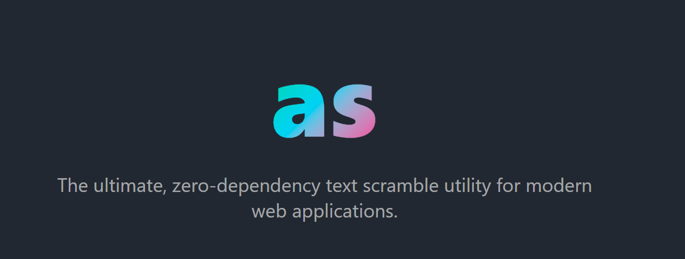
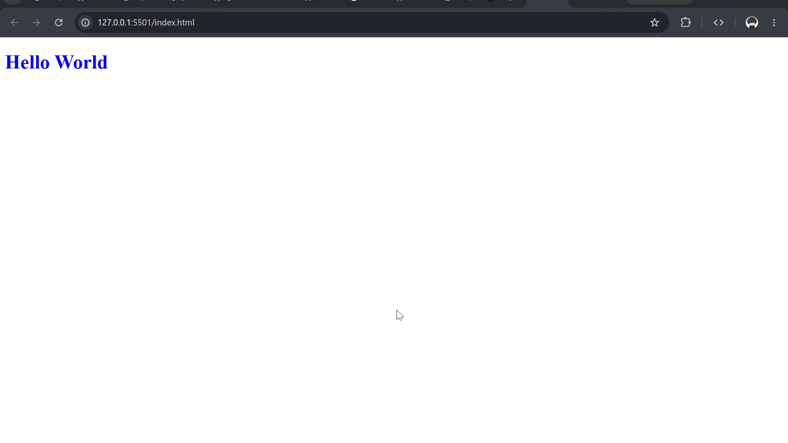

# as aka a Scramble
[](https://www.npmjs.com/package/as)
[](https://bundlephobia.com/package/as)



`as` is a very lightweight text animation library, with no dependencies. It is under 2KB in size.

`as` applies a scramble effect only to the text content, so it won't interfere with the styling of the element itself. It works with vanilla JavaScript as well as frameworks like React, Vue, Svelte, and so on.


It offers pre-styled presets (with hover-triggering by default), including:
- hacker
- matrix
- terminal
- cyberpunk

If those don't suit your taste, you can also create your own custom settings.


## Installation


```bash
npm install as
```

```bash
pnpm add as
```

```bash
yarn add as
```

## Quick Start
A quick guide to using `as`.

Let's say you have a file named `index.html`. You can either insert the script directly into the HTML body or create a separate JavaScript file and call it within the HTML. In this case, let's separate the code into its own file and then call that file in the HTML.

```bash
# index.html
<!doctype html>
<html lang="en">
  <head>
    <title></title>
    <meta charset="UTF-8" />
    <meta name="viewport" content="width=device-width, initial-scale=1" />
    <link href="css/style.css" rel="stylesheet" />
    <script type="module" src="as.js"></script>
  </head>
  <body>
    <h1 id="h1" style="color: blue">Hello World</h1>
  </body>
</html>
```
and a JavaScript file named as.js:
```js
// as.js
import { scramble } from "../node_modules/as/dist/index.mjs";

const el = document.getElementById("h1");

scramble(el, { preset: "terminal",});
```

Since you are using standard JavaScript here, you need to import it from `node_modules`; however, if you were using a framework, you could simply utilize module imports, which is much simpler.
After importing it, you need to use `scramble`, which takes two parameters: the first is the element to which you want to apply the scramble effect, and the second is an object.

here is the result:


## API Reference
You can pass an optional configuration object as the second parameter to customize the animation.

| Option | Type | Default | Description |
| :--- | :--- | :--- | :--- |
| `preset` | `'hacker' \| 'matrix' \| 'terminal' \| 'cyberpunk'` | `undefined` | Uses built-in settings for charset, duration, etc. |
| `trigger` | `'hover' \| 'auto' \| 'click' \| 'focus' \| 'manual'` | `'hover'` | When the animation should start. |
| `duration` | `number` | `800` | The duration of the animation in milliseconds. |
| `delay` | `number` | `0` | Delay before the animation starts (ms). |
| `charset` | `string` | `A-Z` | The characters used during the scrambling phase. |
| `direction` | `'random' \| 'left' \| 'right'` | `'random'` | How the original text is revealed. |
| `easing` | `'linear' \| 'easeIn' \| 'easeOut' \| 'easeInOut'` | `'linear'` | The easing function for the animation speed. |
| `preserveSpaces` | `boolean` | `true` | Keeps spaces intact instead of scrambling them. |
| `preserveSymbols` | `boolean` | `false` | Keeps symbols intact instead of scrambling them. |
| `loop` | `boolean` | `false` | Loops the animation indefinitely. |
| `onStart` | `() => void` | `undefined` | Callback fired when the animation starts. |
| `onComplete` | `() => void` | `undefined` | Callback fired when the animation finishes. |

## Methods
If you use the `manual` trigger, you can call `.play()` to control the animation. This is extremely useful if you have a specific condition that dictates when the animation should play or stop.

```javascript
const anim = scramble(el, { trigger: 'manual' });

anim.play();    // Starts the animation
anim.stop();    // Forcibly stops the animation at its current state
anim.reset();   // Reverts the text to its original state instantly
anim.destroy(); // Cleans up event listeners to prevent memory leaks
```

## Framework Examples
Because `as` is purely vanilla JavaScript, it works seamlessly anywhere. You just need to grab the element reference and pass it to the `scramble()` function.

### React / Next.js
```tsx
import { useEffect, useRef } from 'react';
import { scramble } from 'as';

export default function App() {
  const textRef = useRef(null);

  useEffect(() => {
    if (!textRef.current) return;

    const anim = scramble(textRef.current, { preset: 'hacker' });

    // Cleanup on unmount to prevent memory leaks
    return () => anim.destroy();
  }, []);

  return <h1 ref={textRef}>Hello React</h1>;
}
```

### Vue 3
```vue
<script setup>
import { onMounted, onUnmounted, ref } from 'vue';
import { scramble } from 'as';

const textRef = ref(null);
let anim;

onMounted(() => {
  anim = scramble(textRef.value, { preset: 'cyberpunk' });
});

onUnmounted(() => {
  if (anim) anim.destroy();
});
</script>

<template>
  <h1 ref="textRef">Hello Vue</h1>
</template>
```

### Svelte
```svelte
<script>
  import { onMount } from 'svelte';
  import { scramble } from 'as';

  let textRef;

  onMount(() => {
    const anim = scramble(textRef, { preset: 'matrix' });

    // Returning the destroy function automatically cleans it up
    return () => anim.destroy();
  });
</script>

<h1 bind:this={textRef}>Hello Svelte</h1>
```

## TODO
- [x] Core scramble engine
- [x] Customizable presets (Hacker, Matrix, Terminal, Cyberpunk)
- [x] Playground documentation
- [ ] Add React / Vue native wrapper components
- [ ] Support rich HTML node scrambling

## License
[MIT](LICENSE)
